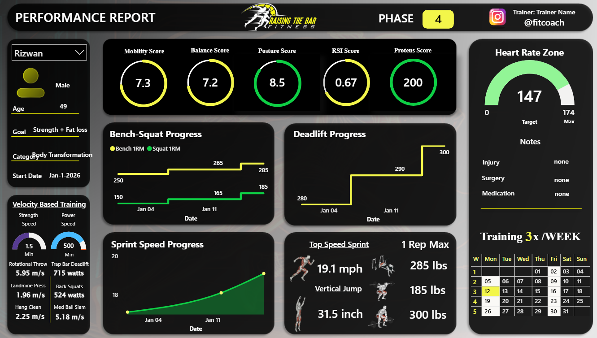

# Athlete-Performance-Tracking-Dashboard
Built a Power BI dashboard for a fitness coach tracking 45 athletes, calculating 1RM progress, mobility scores, and training phase comparisons. Automated monthly reporting, saved 8 hours/week, and contributed to a 20% increase in client retention.

## Overview

A fitness coach working with **45 athletes** had no structured way to show measurable progress. Performance data was being recorded, but there was no clear reporting system to present results to clients.

The goal was simple:

**_Create a professional, easy-to-use dashboard that tracks athlete performance and helps the coach clearly demonstrate improvement._**

### The Problem

* No formal reporting system.

* Athlete progress was not visually tracked over time.

* Difficult to show measurable improvement.

* Hard to justify premium training packages.

* Reporting manually would have taken ~8 hours per week.

* The coach needed a structured and professional way to present results.

### The Solution

**I built a Power BI dashboard that tracks key performance metrics and generates monthly branded athlete reports.**

* The coach can select any athlete and instantly view:

* 1RM progress over time

* Mobility score trends

* Training phase comparisons

* Overall performance improvements

* Data is entered through SharePoint Lists and updates automatically in Power BI Service, allowing near real-time refresh.

* The dashboard is fully branded, enabling the coach to share professional reports directly with athletes.

### What I Did

* Designed the dashboard layout for clarity and easy interpretation.

* Created 17 DAX measures to calculate performance trends and training comparisons.

* Built drill-through pages for detailed athlete-level analysis.

* Set up automated refresh using SharePoint Lists + Power BI Service.

* Worked closely with the coach to refine KPIs and improve calculations.

## Results

* Eliminated manual reporting (_~8 hours_ saved per week).

* Increased client retention by an estimated **20%** in the first month.

* Helped the coach justify **premium packages** by clearly showing measurable progress.

* Improved client engagement through structured monthly performance reports.

### **Want to Work wit me?**

Just email me at: 
## rizwanfordata@gmail.com
